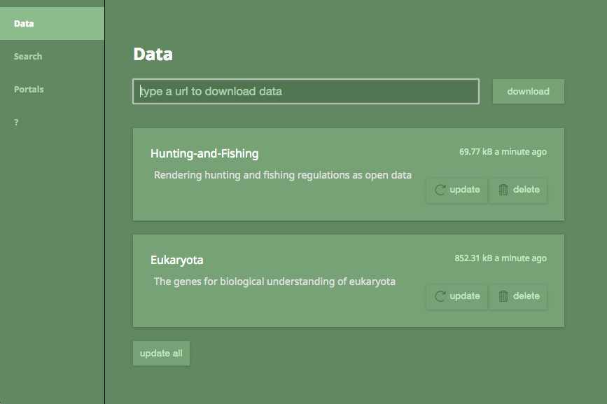

# dps (data per second)

Search, manage, and update datasets. **This is half vaporware right now.**

With open data comes a price. It's difficult to track and manage all of the urls and APIs that provide data. Harvesting data for a simple query like 'city water' will become a nightmare, let alone if you have custom scraping processes to clean that data after it's downloaded! How do you know when the source data has changed? Enter DPS.



## Example

```
dps add http://www.opendatacache.com/cookcounty.socrata.com/api/geospatial/26nm-wd5q cookcounty.geo
```

This puts the following entry into `dps.json`:
```
{
  location: 'http://www.opendatacache.com/cookcounty.socrata.com/api/geospatial/26nm-wd5q',
  type: 'url',
  name: 'cookcounty.geo',
  size: 618400,
  meta: {
    modified: 'Wed Jun 24 2015 14:52:26 GMT-0700 (PDT)',
    checked: 'Tue Sep 22 2015 01:51:43 GMT-0700 (PDT)'
  }
}
```

See status of all my downloads:
```
$ dps status
http://www.opendatacache.com/cookcounty.socrata.com/api/geospatial/26nm-wd5q
  checked: 3 minutes ago  modified: 3 months ago  size: 618.4 kB

http://localhost:6442
  checked: 10 minutes ago modified: 5 hours ago  size: 4.06 kB
```

Check the sources for updates.
```
$ dps update
http://www.opendatacache.com/cookcounty.socrata.com/api/geospatial/26nm-wd5q
  checked: just now  modified: 3 months ago  size: 618.4 kB

http://localhost:6442
  checked: just now  modified: 5 hours ago  size: 4.06 kB
```

## Developer install
```
git clone https://github.com/karissa/dps.git
cd dps
npm install
```
